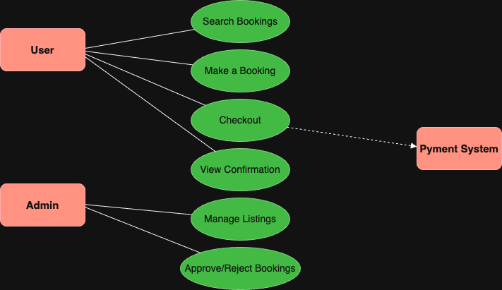

# Requirement Analysis in Software Development

## Introduction

This repository is dedicated to exploring the process of **Requirement Analysis** in Software Development. It covers essential concepts, activities, and techniques used to gather and manage software requirements effectively. It also includes examples and visuals to reinforce understanding using a booking management system case study.

---

## What is Requirement Analysis?

Requirement Analysis is the process of identifying, gathering, analyzing, and documenting the requirements of a software system from stakeholders. It helps ensure the final product meets user needs and business goals.

In the **Software Development Lifecycle (SDLC)**, Requirement Analysis is a foundational phase. It lays the groundwork for design, development, testing, and deployment. Proper analysis helps avoid costly revisions and scope creep later in the project.

---

## Why is Requirement Analysis Important?

- ✅ **Reduces Project Failure**: Clear requirements minimize ambiguity and miscommunication, which reduces the risk of delivering the wrong solution.
- ✅ **Improves Planning**: Well-defined requirements help with accurate cost estimation, timeline planning, and resource allocation.
- ✅ **Enhances Product Quality**: Requirements drive test cases and validation criteria, ensuring the system meets expectations.

---

## Key Activities in Requirement Analysis

- 🔹 **Requirement Gathering**  
  Collecting high-level requirements from stakeholders through interviews, surveys, or documents.

- 🔹 **Requirement Elicitation**  
  Actively engaging with users and stakeholders to extract hidden, implied, or non-obvious requirements.

- 🔹 **Requirement Documentation**  
  Writing clear, structured requirement documents such as SRS (Software Requirement Specification).

- 🔹 **Requirement Analysis and Modeling**  
  Breaking down and organizing requirements using diagrams, models, or structured formats.

- 🔹 **Requirement Validation**  
  Ensuring the requirements are correct, complete, feasible, and agreed upon by all stakeholders.

---

## Types of Requirements

### Functional Requirements

These define **what the system should do**.

**Examples (Booking Management System):**
- Users can search for available bookings.
- Admin can create, edit, or delete listings.
- The system sends a confirmation email after successful booking.

### Non-functional Requirements

These describe **how the system should perform**.

**Examples (Booking Management System):**
- The system must load the booking page in under 2 seconds.
- All sensitive user data must be encrypted.
- The system must support up to 1000 simultaneous users.

---

## Use Case Diagrams

Use Case Diagrams provide a visual representation of how users interact with a system and what actions they can perform.

**Benefits:**
- Clarifies functional requirements.
- Shows interaction between actors and system features.
- Helps identify scope and use cases early in the process.

---

## Acceptance Criteria

Acceptance Criteria are predefined conditions that a software product must meet to be accepted by a user, customer, or system.

**Importance:**
- Ensures the feature behaves as expected.
- Reduces ambiguity for developers and testers.
- Acts as a checklist during testing and validation.

**Example (Checkout Feature in Booking System):**
- User must be able to review the booking details before confirming.
- The payment should process securely using a third-party API.
- A confirmation message should appear after successful payment.
- The system should send a confirmation email to the user.

---
